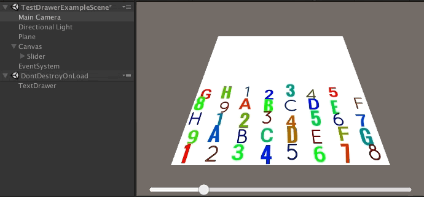
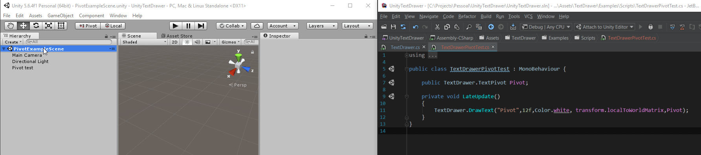

# TextDrawer

Draw beautiful 3D texts with one line of code. It's like `Graphics.DrawMesh`, but for text



## Features!
+ Supports custom fonts
+ Supports multiple font sizes
+ Super Fast! 
+ 0 GC alloc once the cache is filled
+ Supports outlining, bevel, glow and all other [TextMeshPro](https://www.assetstore.unity3d.com/en/#!/content/84126) features
+ *NEW*: Custom pivots
  

## The problem
You know those times when you just want to draw a text on the screen for a short duration, or you want to draw multiple similar texts, but you don't want to go through the hassle of creating/updating/removing game objecs and mono behaviours for such a simple purpose?

`TextDrawer` is here to solve that!

## The solution

`TextDrawer` uses [TextMeshPro](https://www.assetstore.unity3d.com/en/#!/content/84126) as its backend text mesh generator, and manages an internal *LRU* cache to save the previously created meshes. When you want to draw a 3D text in the current frame, just invoke `TextDrawer.DrawText(string text,float fontSize,Color color,Matrix4x4 mat)`.

NOTE: By default, TextDrawer's internal cache holds 400 items at the same time. If you are planning on drawing more than 400 different strings per frame, please increase the cache size through `TextDrawer.CacheCapacity`. 

## Instructions
+ Import the `packages/UnityTextDrawer.unitypackage` to your project
+ If you already have TextMeshPro, deselect it from the import window
+ Add a line of code! (see example below)
+ If you want to use custom fonts, just use `TextMeshPro`'s Create Font asset feature and pass in the resulting font asset to the draw method

## Example

```CSharp
public class TextDrawerTest : MonoBehaviour
{
	public int ShowText;
	
	void Update() {
		if(ShowText) {
			TextDrawer.DrawText("Hello!",12f,Color.white,Matrix4x4.TRS(Vector3.zero,Quaternion.Identity,Vector3.one);
		}
	}
}

```